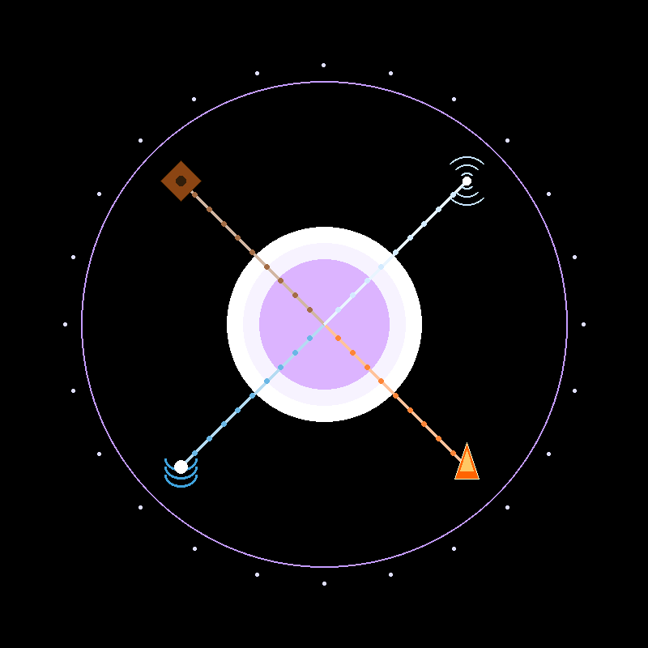
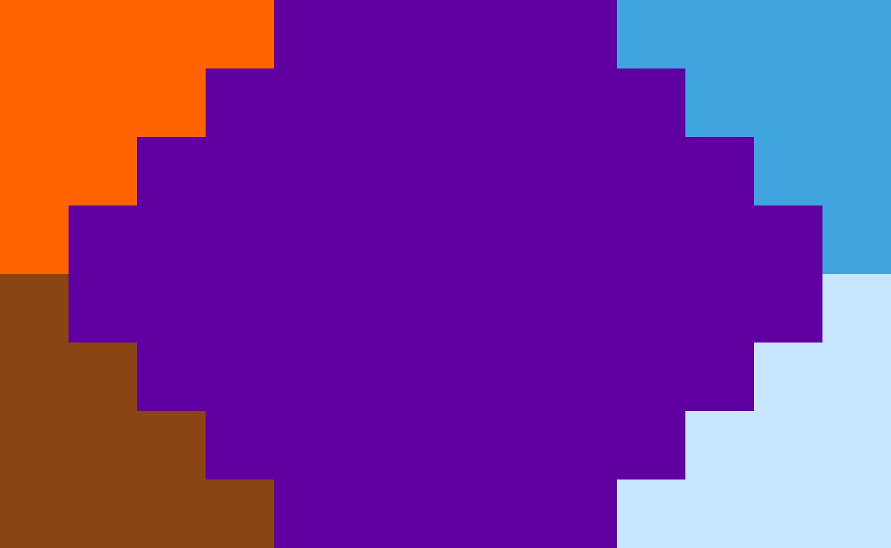

# 奥术超级联合会

奥术超级联合会（英文：The Super League of Arcane），全球亚文化俱乐部联盟（GSCU）俱乐部代号 SLA，是 GSCU 的一个大型俱乐部、九大创始俱乐部之一。2040 年成立于广东省广州市番禺区，并在 2040 年 4 月 8 日同其余八个俱乐部一起创立了 GSCU。

## 俱乐部概况

SLA 是 GSCU 九大创始俱乐部之一，是奇幻小说亚文化圣地。

在 SLA 相当一部分研究员甚至还能自造语言（在创作奇幻小说的时候会用到）。

截至 UTC 2060 年 4 月 8 日零点，LFN 一共有 4028 队，18539 据点，4860283 名研究员（≈486.03 万）；全俱乐部总共有 8123 名俱乐部秘书和 3748 名副部长（其中，副部长领班 155 名，而这些领班当中又有 7 名大领班）。

## 俱乐部标志

俱乐部徽章：

SLA 的俱乐部徽章名为"四元合一"。

徽章为圆形，中心是一个代表"空"或"灵魂"的浅粉色发光球体。

围绕中心球体，是四个风格统一的元素符号（火（右下）、水（左下）、土（左上）、风（右上）），它们并非静止，而是通过流动的线条（每条各有 9 个圆点）连向中心，仿佛在向中心输送能量。

整个轮盘周围有 24 个点，带有一种正在缓慢旋转的动感。

俱乐部旗帜：

SLA 的旗帜名为"奥术之阵"，旗帜长宽比为 13:8。

将整面旗帜分为 13 行 8 列网格。用阿拉伯数字命名列，大写字母命名行，每个方格先数字再字母，用五种颜色填充：

- 橙红色（RGB(255, 100, 0)，代表火元素）：01A、02A、03A、04A、01B、02B、03B、01C、02C、01D。
- 蓝色（RGB(64, 164, 223)，代表水元素）：10A、11A、12A、13A、11B、12B、13B、12C、13C、13D。
- 棕色（RGB(139, 69, 19)，代表土元素）：01E、01F、02F、01G、02G、03G、01H、02H、03H、04H。
- 浅蓝色（RGB(200, 230, 255)，代表风元素）：13E、12F、13F、11G、12G、13G、10H、11H、12H、13H。
- 紫色（RGB(96, 0, 160)，代表以太元素）：其余方格。

俱乐部代表色：橙红色、蓝色、棕色、浅蓝色、紫色

俱乐部吉祥物：

SLA 的俱乐部吉祥物名为"星幻雪人"。

"星幻雪人"通体呈浅蓝色，象征如晴空般的纯净与如坚冰中的坚韧；双臂由紫色法杖组成，象征 SLA 是奇幻小说亚文化圣地；鼻子并非常规的胡萝卜，而是深蓝色银河魔法球；头顶还戴有一座深紫色星空魔术帽。

俱乐部口号：奥术联合，坚不可摧！

俱乐部歌曲：

《奥术的联合》

词：SLA0001-00100001

曲：SLA0001-00100001

[Intro]

奥术联合，坚不可摧！

奇幻之力，无懈可击！

我们是 SLA，奥术超级联合会！

我们是 SLA，战无不胜的奇幻亚文化！

[Verse 1]

我们是 SLA，奥术超级联合会！

奥术联合的力量无穷无尽！

波涛汹涌之水，带领我们过关斩将！

熊熊燃烧之火，带领我们照亮希望！

沃野千里之土，永续我们的亚文化生命！

飞沙走石之风，让亚文化的种子飘遍全世界！

力量之源以太，带领我们走向未来！

[Verse 2]

我们是 SLA，奥术超级联合会！

我们是 SLA，战无不胜的奇幻亚文化！

奥术联合的力量，让我们的亚文化欣欣向荣！

我们不是什么超级英雄，但亚文化之光将照耀世界各地！

（英语版本）：

"Arcane Alliance"

Lyrics: SLA0001-00100001

Music: SLA0001-00100001

[Intro]

Arcane Alliance, Unbreakable!

Fantasy Power, Invincible!

We are SLA, The Super League of Arcane!

We are SLA, the invincible fantasy subculture!

[Verse 1]

We are SLA, The Super League of Arcane!

The power of the Arcane Alliance is boundless!

The surging waters lead us through all obstacles!

The blazing fire leads us to illuminate hope!

The fertile land sustains the life of our subculture!

The winds of war spread the seeds of our subculture throughout the world!

The source of power, Aether, leads us to the future!

[Verse 2]

We are SLA, The Super League of Arcane!

We are SLA, the invincible fantasy subculture!

The power of the Arcane Alliance makes our subculture flourish!

We are not superheroes, but the light of subculture will shine all over the world!
